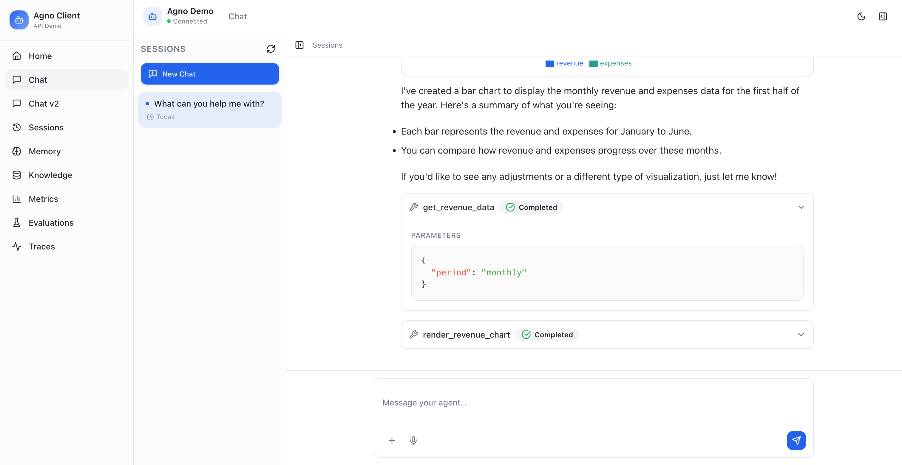

# Agno Client Libraries

Independent open-source client libraries for [Agno](https://www.agno.com) agents with streaming support.



## 📦 Packages

This monorepo contains three packages:

- **[@rodrigocoliveira/agno-client](./packages/core)** - Core stateful client library
- **[@rodrigocoliveira/agno-react](./packages/react)** - React hooks adapter
- **[@rodrigocoliveira/agno-types](./packages/types)** - Shared TypeScript types

## 🔒 Security & Best Practices

Built with production-ready security features:

- **Request Cancellation** - Single `cancelRun()` method that aborts client stream AND notifies backend to stop processing
- **Secure Logging** - Production-safe logger that automatically sanitizes auth tokens and sensitive data
- **URL Encoding** - Automatic encoding of entity IDs to prevent path traversal and injection attacks
- **Timestamp Validation** - Safe date handling with bounds checking to prevent invalid timestamps
- **Error Handling** - Graceful handling of malformed responses and content-type validation
- **Immutable State** - Consistent immutable updates throughout the codebase
- **Type Safety** - Full TypeScript support with comprehensive type definitions
- **Auto Token Refresh** - `onTokenExpired` callback for automatic 401 handling and retry

### Securing Auth Tokens

When using the client in a browser, auth tokens are visible in the Network tab. For production apps, we recommend:

1. **Use short-lived tokens** (15 minutes or less)
2. **Configure automatic refresh** via `onTokenExpired`

```typescript
<AgnoProvider
  config={{
    endpoint: 'http://localhost:7777',
    authToken: initialToken,
    agentId: 'your-agent-id',

    // Called when a request gets 401 Unauthorized
    onTokenExpired: async () => {
      const response = await fetch('/api/refresh-token');
      const { token } = await response.json();
      return token;  // Library will retry the failed request
    },
  }}
>
```

See [Secure Authentication Cookbook](./cookbooks/17_secure_auth.md) for complete examples with Laravel, Express, and more.

## 🚀 Quick Start

### Installation

```bash
# For React applications
npm install @rodrigocoliveira/agno-react
# or
bun add @rodrigocoliveira/agno-react

# For other JavaScript/TypeScript projects
npm install @rodrigocoliveira/agno-client
# or
bun add @rodrigocoliveira/agno-client

# For types only (if using the core library)
npm install @rodrigocoliveira/agno-types
# or
bun add @rodrigocoliveira/agno-types
```

### React Example

```tsx
import { AgnoProvider, useAgnoChat, useAgnoActions } from '@rodrigocoliveira/agno-react';

function App() {
  return (
    <AgnoProvider
      config={{
        endpoint: 'http://localhost:7777',
        mode: 'agent',
        agentId: 'your-agent-id',
        userId: 'user-123', // Optional: Link sessions to a user
      }}
    >
      <ChatComponent />
    </AgnoProvider>
  );
}

function ChatComponent() {
  const { messages, sendMessage, isStreaming } = useAgnoChat();
  const { initialize } = useAgnoActions();

  useEffect(() => {
    initialize();
  }, [initialize]);

  return (
    <div>
      {messages.map((msg, i) => (
        <div key={i}>
          <strong>{msg.role}:</strong> {msg.content}
        </div>
      ))}
      <button
        onClick={() => sendMessage('Hello!')}
        disabled={isStreaming}
      >
        Send
      </button>
    </div>
  );
}
```

### Core Client Example

```typescript
import { AgnoClient } from '@rodrigocoliveira/agno-client';

const client = new AgnoClient({
  endpoint: 'http://localhost:7777',
  mode: 'agent',
  agentId: 'your-agent-id',
  userId: 'user-123', // Optional: Link sessions to a user
});

// Listen to events
client.on('message:update', (messages) => {
  console.log('Messages updated:', messages);
});

// Send a message
await client.sendMessage('Hello!');
```

## 🏗️ Development

### Prerequisites

- Node.js 18+
- pnpm 8+

### Setup

```bash
# Install dependencies
pnpm install

# Build all packages
pnpm build

# Watch mode for development
pnpm dev

# Type checking
pnpm typecheck
```

### Project Structure

```
agno-client/
├── packages/
│   ├── core/          # @rodrigocoliveira/agno-client
│   ├── react/         # @rodrigocoliveira/agno-react
│   └── types/         # @rodrigocoliveira/agno-types
├── examples/
│   └── react-chat/    # Example React app
└── package.json       # Monorepo root
```

## ✨ Features

### Frontend Tool Execution (HITL)

The library includes built-in support for Human-in-the-Loop (HITL) frontend tool execution, allowing your Agno agents to delegate tools to the browser:

- **UI Automation**: Navigate pages, fill forms, click buttons
- **Browser APIs**: Access geolocation, notifications, local storage
- **User Confirmation**: Get user approval for sensitive operations
- **External Integrations**: Call APIs not accessible from the backend

### Generative UI

Create rich, interactive UI components directly from agent responses:

- **Agent-Driven Visualizations**: Let agents decide what charts and components to render
- **Interactive Charts**: Bar, line, area, and pie charts with export functionality (CSV/PNG)
- **Card Grids & Tables**: Display structured data with sortable, filterable tables
- **Custom Components**: Extend with your own component renderers
- **Persistent UI**: Components survive page refreshes (serializable specs)

See [Frontend Tool Execution & Generative UI Guide](./FRONTEND_TOOL_EXECUTION.md) for detailed usage instructions.

### Quick Example: Frontend Tools

```tsx
import { useAgnoToolExecution } from '@rodrigocoliveira/agno-react';

function ChatComponent() {
  const toolHandlers = {
    navigate_to_page: async (args: { url: string }) => {
      window.location.href = args.url;
      return { success: true };
    },
    get_location: async () => {
      const position = await new Promise((resolve) =>
        navigator.geolocation.getCurrentPosition(resolve)
      );
      return {
        latitude: position.coords.latitude,
        longitude: position.coords.longitude,
      };
    },
  };

  const { isPaused, isExecuting, pendingTools } =
    useAgnoToolExecution(toolHandlers);

  // Tools execute automatically when agent requests them
}
```

## 📚 Documentation

- [Core Client API](./packages/core/README.md)
- [React Hooks API](./packages/react/README.md)
- [Type Definitions](./packages/types/README.md)
- [Frontend Tool Execution & Generative UI](./FRONTEND_TOOL_EXECUTION.md)

## 🤝 Contributing

Contributions are welcome! This is an independent open-source project.

1. Fork the repository
2. Create your feature branch (`git checkout -b feature/amazing-feature`)
3. Commit your changes (`git commit -m 'Add some amazing feature'`)
4. Push to the branch (`git push origin feature/amazing-feature`)
5. Open a Pull Request

## 📄 License

MIT

## 🙏 Acknowledgments

This library is built to work with [Agno](https://www.agno.dev) agents. It is an independent open-source project and is not officially affiliated with or endorsed by Agno.
